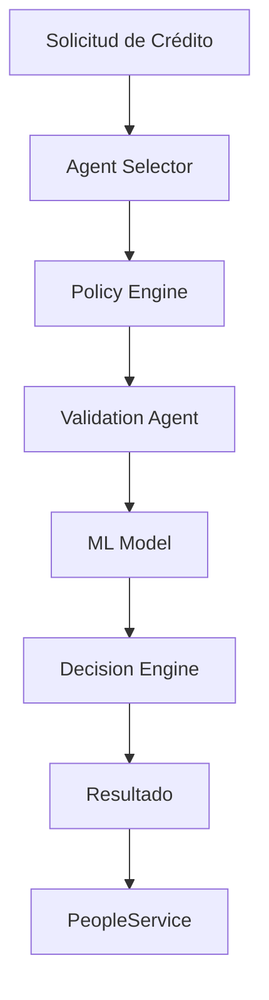

#  AgentService - Prestek Platform

**Microservicio de Agentes de IA para Validación Crediticia**

El AgentService es un componente clave de la plataforma Prestek que implementa agentes de inteligencia artificial configurables para realizar prevalidaciones automáticas de solicitudes de crédito basándose en las políticas específicas de cada entidad financiera.

##  Descripción General

El AgentService forma parte del ecosistema de microservicios de Prestek, una plataforma digital que conecta usuarios en búsqueda de créditos con entidades financieras. Este servicio específicamente maneja:

- **Agentes de IA configurables** por entidad financiera
- **Prevalidación automática** de solicitudes de crédito
- **Aplicación de políticas crediticias** dinámicas
- **Reducción de rechazos** mediante filtrado inteligente
- **Optimización de tiempos** de aprobación

### Propósito en el Ecosistema

Este microservicio se integra con:
- **PeopleService**: Recibe datos de usuarios y solicitudes
- **Frontend React**: Proporciona validaciones en tiempo real
- **Entidades Financieras**: Aplica sus políticas específicas

---

##  Características

###  Estado Actual
-  Configuración base de Spring Boot
-  Integración con PostgreSQL
-  Documentación automática con Swagger/OpenAPI
-  Configuración CORS para desarrollo
-  Manejo de variables de entorno
-  Logging estructurado

###  En Desarrollo
-  Modelos de agentes de IA
-  APIs de validación crediticia
-  Motor de reglas configurable
-  Integración con modelos de ML
-  Sistema de políticas dinámicas

###  Funcionalidades Planificadas
-  Agentes de IA generativa para asesoría
-  Integración con bureaus de crédito
-  Analytics y métricas de validación
-  Sistema de aprendizaje continuo

---

##  Arquitectura

```
AgentService
├──  REST API Layer
├──  Agent Engine
│   ├── Validation Agents
│   ├── Policy Engine
│   └── ML Models
├──  Data Access Layer
├──  External Integrations
└──  Monitoring & Logging
```

### Flujo de Validación



---

##  Tecnologías

| Categoría | Tecnología | Versión |
|-----------|------------|---------|
| **Framework** | Spring Boot | 3.5.5 |
| **Java** | OpenJDK | 21 |
| **Base de Datos** | PostgreSQL | 15+ |
| **ORM** | JPA/Hibernate | 6.x |
| **Documentación** | SpringDoc OpenAPI | 2.8.9 |
| **Build Tool** | Maven | 3.9+ |
| **Logging** | SLF4J + Logback | - |
| **Testing** | JUnit 5 + Mockito | - |

---

##  Configuración

### Prerrequisitos

- **Java 21** o superior
- **Maven 3.9+**
- **PostgreSQL 15+**
- **Git**

### Base de Datos

```sql
CREATE DATABASE prestek_agents;

CREATE USER prestek_agent WITH PASSWORD 'your_password';
GRANT ALL PRIVILEGES ON DATABASE prestek_agents TO prestek_agent;

CREATE SCHEMA agent_service;
```

---

##  Instalación y Ejecución

### 1. Clonar el Repositorio

```bash
git clone https://github.com/Prestek/AgentService.git
cd AgentService
```

### 2. Configurar Variables de Entorno

Crear archivo `.env` en la raíz del proyecto:

```env
# Database Configuration
DB_URL=jdbc:postgresql://localhost:5432/prestek_agents
DB_USERNAME=prestek_agent
DB_PASSWORD=your_password
DB_SCHEMA=agent_service

# CORS Configuration
ALLOWED_ORIGINS_HTTP=http://localhost:3000,http://localhost:3001
ALLOWED_ORIGINS_HTTPS=https://localhost:3000,https://localhost:3001

# Server Configuration
SERVER_PORT=8081

# AI/ML Configuration (Futuro)
OPENAI_API_KEY=your_openai_key
ML_MODEL_ENDPOINT=http://localhost:8082
```

### 3. Compilar y Ejecutar

```bash
mvn clean compile

mvn test

mvn spring-boot:run

./mvnw spring-boot:run
```

### 4. Verificar la Instalación

- **Aplicación**: http://localhost:8081
- **Swagger UI**: http://localhost:8081/swagger-ui.html
- **API Docs**: http://localhost:8081/api-docs

---

##  API Documentation

### Endpoints Base

| Método | Endpoint | Descripción | Estado |
|--------|----------|-------------|--------|
| `GET` | `/api/agents` | Listar agentes |  Planeado |
| `POST` | `/api/agents` | Crear agente |  Planeado |
| `GET` | `/api/agents/{id}` | Obtener agente |  Planeado |
| `PUT` | `/api/agents/{id}` | Actualizar agente |  Planeado |
| `DELETE` | `/api/agents/{id}` | Eliminar agente |  Planeado |

### Validación de Crédito

| Método | Endpoint | Descripción | Estado |
|--------|----------|-------------|--------|
| `POST` | `/api/validate/credit` | Validar solicitud |  Planeado |
| `POST` | `/api/validate/user` | Validar usuario |  Planeado |
| `GET` | `/api/validate/policies` | Listar políticas |  Planeado |

### Health Check

| Método | Endpoint | Descripción | Estado |
|--------|----------|-------------|--------|
| `GET` | `/actuator/health` | Estado del servicio |  Disponible |
| `GET` | `/actuator/info` | Información del servicio |  Disponible |

### Documentación Interactiva

Una vez que el servicio esté ejecutándose, puedes acceder a:

- **Swagger UI**: `http://localhost:8081/swagger-ui.html`
- **OpenAPI JSON**: `http://localhost:8081/api-docs`

---

##  Variables de Entorno

### Configuración de Base de Datos

```env
DB_URL=jdbc:postgresql://host:port/database
DB_USERNAME=username
DB_PASSWORD=password
DB_SCHEMA=schema_name
```

### Configuración de CORS

```env
ALLOWED_ORIGINS_HTTP=http://localhost:3000,http://localhost:3001
ALLOWED_ORIGINS_HTTPS=https://domain1.com,https://domain2.com
```

### Configuración de IA (Futuro)

```env
OPENAI_API_KEY=sk-...
ML_MODEL_ENDPOINT=http://ml-service:8082
AGENT_CONFIG_PATH=/config/agents
```

---

##  Desarrollo

### Estructura del Proyecto

```
src/
├── main/
│   ├── java/com/prestek/agent/
│   │   ├── AgentServiceApplication.java
│   │   ├── config/
│   │   │   ├── CorsConfig.java
│   │   │   └── OpenApiConfig.java
│   │   ├── controller/          #  Por implementar
│   │   ├── service/             #  Por implementar
│   │   ├── model/               #  Por implementar
│   │   ├── repository/          #  Por implementar
│   │   └── dto/                 #  Por implementar
│   └── resources/
│       └── application.properties
└── test/
    └── java/com/prestek/agent/
        └── AgentServiceApplicationTests.java
```

### Convenciones de Código

- **Nombres**: CamelCase para clases, camelCase para métodos
- **Packages**: Organización por funcionalidad
- **Logging**: Uso de SLF4J con Lombok
- **Testing**: JUnit 5 + Mockito
- **Documentation**: JavaDoc para APIs públicas

### Configuración IDE

#### IntelliJ IDEA
1. Importar como proyecto Maven
2. Configurar JDK 21
3. Instalar plugin Lombok
4. Configurar format de código

#### VS Code
1. Instalar Extension Pack for Java
2. Configurar settings.json para Java 21
3. Instalar Lombok Annotations Support

---

##  Testing

### Ejecutar Tests

```bash
# Todos los tests
mvn test

# Tests específicos
mvn test -Dtest=AgentServiceApplicationTests

# Tests con cobertura
mvn jacoco:report
```

### Estructura de Tests

```
src/test/java/
├── unit/                    # Tests unitarios
├── integration/             # Tests de integración
└── e2e/                     # Tests end-to-end
```

### Coverage Goal

- **Objetivo**: 80% de cobertura de código
- **Crítico**: 100% para lógica de validación
- **Reports**: `target/site/jacoco/index.html`

---

## Docker

### Dockerfile (Futuro)

```dockerfile
FROM openjdk:21-jdk-slim

WORKDIR /app
COPY target/agent-service-*.jar app.jar

EXPOSE 8081

CMD ["java", "-jar", "app.jar"]
```

### Docker Compose

```yaml
version: '3.8'
services:
  agent-service:
    build: .
    ports:
      - "8081:8081"
    environment:
      - DB_URL=jdbc:postgresql://postgres:5432/prestek_agents
    depends_on:
      - postgres
      
  postgres:
    image: postgres:15
    environment:
      POSTGRES_DB: prestek_agents
      POSTGRES_USER: prestek
      POSTGRES_PASSWORD: password
    ports:
      - "5432:5432"
```

---

##  Licencia

Este proyecto está bajo la Licencia MIT. Ver [LICENSE](LICENSE) para más detalles.

---


**Prestek Team** © 2024 - Democratizando el acceso al crédito en LATAM 🚀